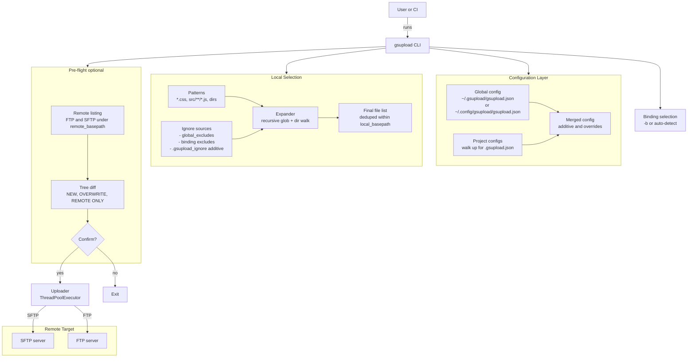
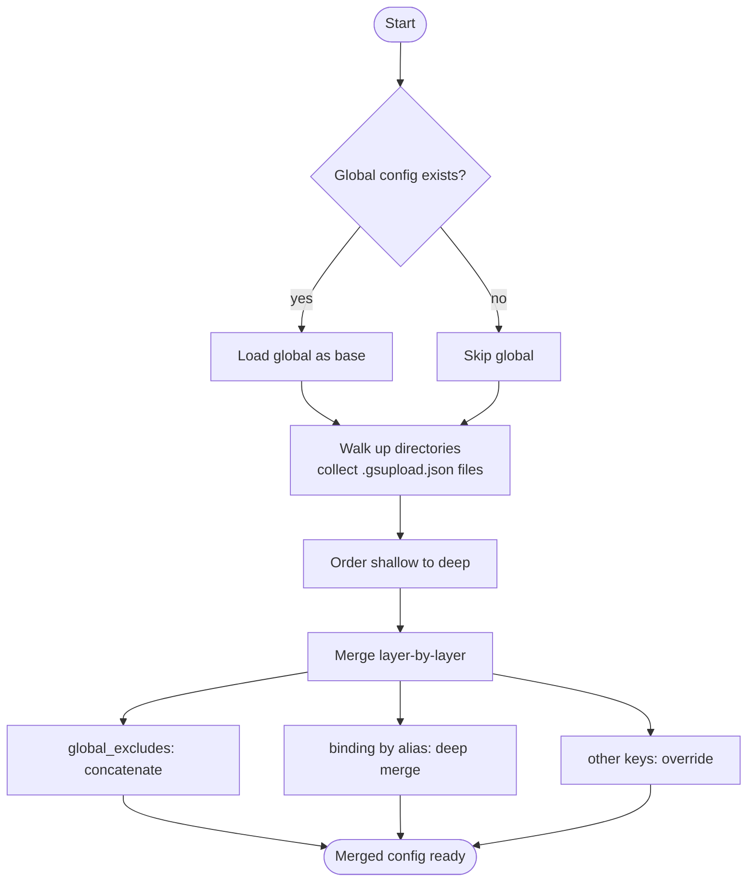
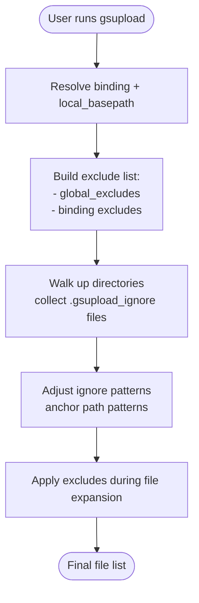
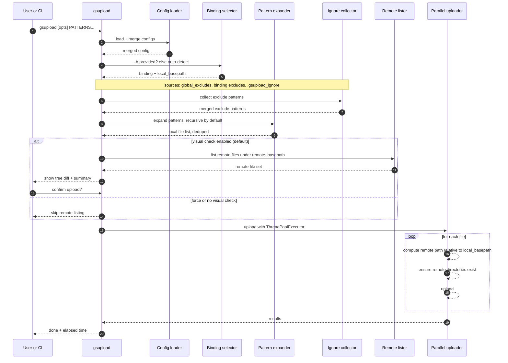

If you've ever done "just upload these files to the server" often enough, you know what happens next: manual steps, inconsistent excludes, someone overwrites the wrong thing, or a deploy goes out with `node_modules/` by accident.

This post introduces **gsupload**, a small Python CLI I built to make FTP/SFTP uploads repeatable:

- Bind **host targets** by alias (SFTP or FTP)
- Discover and **merge config files up the directory tree** (global → project → subfolder)
- Apply **additive ignore patterns** from config + `.gsupload_ignore`
- Show a **pre-flight tree comparison** (local vs remote) before uploading
- Upload using **parallel workers** (with SSH compression for SFTP)

Repository: https://github.com/guspatagonico/gsupload-python

---

## Who this is for

- Sysadmins and DevOps engineers maintaining "a few servers" with repeatable uploads
- Full-stack developers shipping static assets / hotfixes / small site updates
- Anyone automating repetitive, error-prone FTP/SFTP workflows

If you need a full artifact pipeline with rollbacks, canaries and immutable releases: keep using your CD platform. If you need a fast, predictable "sync these files into that remote base path" tool: this fits.

---

## Mental model (what gsupload actually does)

At a high level, `gsupload` does four things:

1. **Loads configuration** (global + layered `.gsupload.json` files)
2. **Selects a binding** (explicit `-b` or auto-detected from your current directory)
3. **Expands patterns** (recursive globbing by default) and applies excludes
4. Optionally **compares remote vs local** and asks for confirmation
5. Uploads matching files in parallel (threads)

### Architecture overview



---

## Installation (uv tool recommended)

`gsupload` is packaged as a Python CLI. The cleanest way to use it globally is `uv tool`:

```bash
uv tool install --editable /path/to/gsupload-python
uv tool update-shell

# new shell session

gsupload --help
```

For local development:

```bash
uv pip install -e ".[dev]"
python src/gsupload.py --help
```

---

## Configuration: layered, mergeable, and portable

`gsupload`'s killer feature is that configuration is **discovered and merged**.

### Config discovery order

- Optional global base layer:
  - `~/.gsupload/gsupload.json` **or** `~/.config/gsupload/gsupload.json`
- Project layers:
  - it walks up from your current directory and collects every `.gsupload.json`
  - then merges them from shallowest → deepest (root → cwd)

### Merge rules (the "additive config" part)

- `global_excludes`: **additive** (combined across all configs)
- `bindings`: merged per binding name (deeper properties override; unspecified properties are inherited)
- Any other top-level key: simple override (deepest wins)



### Example config (one binding)

Create a `.gsupload.json` at your repo root:

```json
{
  "global_excludes": [".DS_Store", "*.log", ".git", "node_modules"],
  "bindings": {
    "frontend": {
      "protocol": "sftp",
      "hostname": "example.com",
      "port": 22,
      "username": "deploy",
      "key_filename": "~/.ssh/id_ed25519",
      "max_workers": 10,
      "local_basepath": ".",
      "remote_basepath": "/var/www/html"
    }
  }
}
```

Notes:

- `local_basepath` can be absolute, relative (resolved from config file location), or omitted (defaults to the config file directory).
- For SFTP you can authenticate via SSH agent, password auth, key auth, or encrypted key + passphrase.

### Inspect the merged config

This is your "what will happen if I run this here?" command:

```bash
gsupload --show-config
```

It prints the merge order and which file contributed each key.

---

## Excludes: config + ignore files (additive)

Excludes come from three places, combined together:

1. `global_excludes` in config
2. `excludes` inside a binding
3. `.gsupload_ignore` files (collected walking up from cwd to `local_basepath`)

This is intentionally close to `.gitignore` ergonomics.

### User flow for ignores



To debug ignores:

```bash
# auto-detect binding
gsupload --show-ignored

# current dir only
gsupload --show-ignored -nr

# explicit binding
gsupload --show-ignored -b=frontend
```

---

## CLI usage you'll actually use

The CLI shape is intentionally small:

```bash
gsupload [OPTIONS] PATTERNS...
```

Key defaults:

- Recursive file matching is **enabled** by default (`-r`)
- "Complete visual check" is **enabled** by default (`-vcc`)

Useful inspection flags:

- `--show-config`: print the merged config + source annotations
- `--show-ignored`: show what will be excluded for the active binding
- `--version`: print the CLI version

### Always quote patterns

You must quote globs so your shell doesn't expand them before `gsupload` sees them:

```bash
# correct
gsupload "*.css"

gsupload -b=frontend "src/**/*.js"

# wrong (shell expands before gsupload runs)
gsupload *.css
```

### Typical workflows

Pre-flight review (default behavior):

```bash
# recursive + complete tree comparison + confirmation
gsupload "*.css"
```

Changes-only visual check (faster scan output; doesnt list remote-only files):

```bash
gsupload -vc "*.css"
```

Fast mode for automation / CI (no remote scan, no prompt):

```bash
gsupload -f -b=frontend "dist/**/*"
```

Alternative "no pre-flight" mode (still expands patterns and applies excludes, but skips remote listing and confirmation):

```bash
gsupload -nvcc -b=frontend "dist/**/*"
```

Tune parallelism:

```bash
# override per run
gsupload --max-workers=10 "*.css"

# debug / conservative
gsupload --max-workers=1 "*.css"
```

FTP active mode (only when you know you need it):

```bash
gsupload --ftp-active "*.html"
```

---

## Data flow: from patterns to remote paths

Understanding the data flow helps you reason about safety and predictability.



Remote paths are computed as:

$$\text{remote\_path} = \text{remote\_basepath} + "/" + \text{relative(local\_file, local\_basepath)}$$

That means you can safely move between machines as long as your `local_basepath` matches the local project root.

---

## The visual check: practical "diff before deploy"

This is what makes `gsupload` feel safer than "just upload and hope":

- `[NEW]` → file does not exist remotely (within `remote_basepath`)
- `[OVERWRITE]` → file exists remotely and will be replaced
- `[REMOTE ONLY]` → exists on server but not locally (shown in complete mode)

Three modes:

- Default / complete: `-vcc` (includes remote-only)
- Changes only: `-vc` (doesn't list remote-only, still reports counts)
- No check: `-f` or `-nvcc` (skip remote listing)

---

## Performance notes (why it's fast enough)

`gsupload` is optimized for the common "many small web assets" case:

- Parallel uploads (`ThreadPoolExecutor`) default to 5 workers
- Per-file connections (each worker opens its own FTP/SFTP connection)
- SFTP enables SSH compression (`compress=True`) to speed up text assets
- Remote directory creation is cached to avoid repeated `mkdir/stat`

Rule of thumb:

- SFTP: you can often push to 5-10 workers
- FTP: keep it conservative (1-3) depending on server limits

---

## Security posture: don't commit secrets

SFTP is encrypted; FTP is not.

Recommended practices:

- Put **credentials in global config** (`~/.gsupload/...`) and keep project config in git.
- Prefer **SSH agent authentication** (no passwords in JSON).
- If you must use keys in config, point to a local path; avoid committing key files.

A nice split for teams:

- Repo: `.gsupload.json` contains only non-secret defaults (paths, excludes, binding names)
- Personal machine: `~/.gsupload/gsupload.json` contains hostname/username/credentials overrides

---

## Using it in automation (CI / scripts)

For non-interactive runs, use `-f`:

```bash
# Example: deploy compiled assets
cd /repo
npm run build

# Upload build output without prompting
gsupload -f -b=frontend "dist/**/*"
```

Pair this with a dedicated deploy user and least-privilege remote paths.

---

## Troubleshooting checklist

- No files found?
  - Quote your glob: `gsupload "*.css"`
  - Check ignores: `gsupload --show-ignored`
- Binding not detected?
  - Run `gsupload --show-config` and confirm `local_basepath`
  - Specify binding explicitly: `gsupload -b=frontend ...`
- Remote listing slow?
  - Use changes-only: `-vc`
  - Or skip it: `-f`
- FTP connectivity issues?
  - Default is passive mode. Try `--ftp-active` only if you know your network requires it.

---

## Closing

`gsupload` is intentionally small: one CLI, layered config, predictable ignore rules, a safety pre-flight diff, and parallel uploads. It's the kind of tool that pays for itself the third time you avoid uploading the wrong directory.

If you try it and you want improvements, the best next steps are usually:

- adding more binding metadata (environment names, tags)
- integrating secrets via OS keychains or env vars (without breaking the "simple config" story)
- adding a dry-run mode for CI pipelines that only reports diffs

I'm also open to collaborations and networking around this kind of tooling. If you're using `gsupload` (or building something similar) and you want to discuss workflows, edge cases, or potential improvements:

- open an issue or PR in the repository
- share your constraints (hosting panels, chrooted SFTP, FTP quirks, CI needs)
- suggest features that keep the tool pragmatic and easy to operate

---

_Star the repo and contribute: [guspatagonico/gsupload-python](https://github.com/guspatagonico/gsupload-python)_