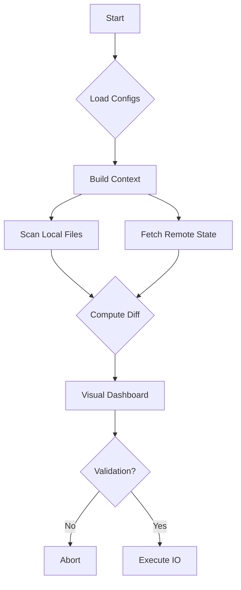
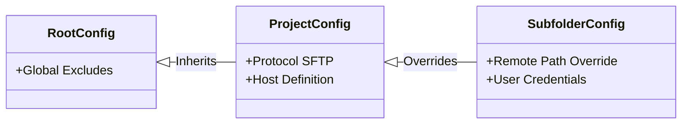

Here is the updated post. I have removed the specific infrastructure references, stripped emojis from titles, replaced long hyphens with standard punctuation, and simplified the Mermaid syntax to ensure it renders correctly in all parsers.

***

# Infrastructure as Code for Legacy: Safe, Deterministic SFTP Deploys

Let's be honest. As senior developers, we spend most of our time architecting complex cloud systems, tuning containers, and optimizing pipelines. But we also know the reality of the industry: sometimes, you just need to get files onto a simple server.

Maybe it is a legacy monolith, a rapid client prototype, or a specialized environment where you only have SFTP access. The "junior" solution is dragging folders in FileZilla. The "senior" solution usually involves writing a brittle Bash script that eventually breaks or fails to handle edge cases.

I built **`gsupload`** to fill the gap between manual transfers and enterprise pipelines. It is a Python CLI designed with **S.O.L.I.D. principles**, offering the determinism, concurrency, and safety of a modern tool, without the infrastructure bloat.

## The Philosophy: "State Engine" Deployment

This is not just a file copier; it is a state engine. I designed `gsupload` to solve the specific pain points of legacy deployment: lack of visibility and lack of context.

The goal was simple: **Zero-Anxiety Deploys.**

## The Architecture: Determinism over "Fire and Forget"

I wanted this tool to be robust. It builds a complete state of the world before performing any IO operations. Here is the **Deployment Pipeline** that runs every time you execute a command:



## 1. The "Monorepo" Pattern: Cascading Configuration

The most powerful architectural feature is the **Configuration Inheritance System**. It allows you to maintain D.R.Y. (Don't Repeat Yourself) principles across complex directory structures.

It uses a **Merger Strategy** similar to CSS specificity:
1.  **Global:** System-wide excludes (e.g., `.DS_Store`).
2.  **Project:** Repository-level host definitions.
3.  **Context:** Sub-directory overrides for specific environments.



## 2. Performance: Parallelism by Default

We are not just moving files one by one. The latest version of `gsupload` implements a **Threaded Worker Pool**.

*   **Concurrency:** By default, it spins up 5 workers to upload files in parallel. You can tune this with `--max-workers=10` if your bandwidth allows.
*   **Compression:** SSH compression is enabled automatically for SFTP, significantly reducing transfer time for text-based assets (JS/CSS/HTML).

## 3. The "Dry Run" Standard

This is the critical feature for senior workflows. When you run the command, it performs a **Visual Dry Run** by default. It diffs the local filesystem against the remote tree before a single byte is written.

```bash
gsupload -b=production "css/*.css" "js/app.js"
```

The output provides immediate clarity:

```text
Visual Check:
├── css/
│   ├── main.css [OVERWRITE]  <-- Yellow indicates modification
│   └── theme.css [NEW]       <-- Green indicates creation
└── js/
    └── app.js [OVERWRITE]

Proceed with upload? [y/N]
```

**New View Modes:**
*   **`-vcc` (Complete):** Shows the full tree, including files that exist on the remote server but not locally (great for spotting drift).
*   **`-vc` (Changes Only):** Hides the noise. Only shows what will actually be uploaded.
*   **`-ts` (Tree Summary):** Skips the visual tree and just reports the stats (e.g., "5 new, 2 overwrites").

## 4. Observability & Debugging

Implicit magic is the enemy of reliability. I added specific flags to inspect the tool's decision-making process:

*   **`--show-config`**: Prints a **Source Map** of your configuration. It tells you exactly which JSON file contributes to every setting (host, user, excludes), helping you debug complex inheritance chains.
*   **`--show-ignored`**: Audits your exclude patterns. It lists every file skipped by `.gitignore` or `.gsupload_ignore`, ensuring you aren't silently failing to upload critical assets.

## Usage: Developer Experience First

We use `uv` for modern, fast Python tool management.

### Installation

```bash
uv tool install --editable /path/to/gsupload-python
```

### Configuration (.gsupload.json)

Define your "bindings" (environments) as code.

```json
{
  "bindings": {
    "production": {
      "protocol": "sftp",
      "hostname": "mysite.com",
      "username": "admin",
      "remote_basepath": "/var/www/html"
    }
  }
}
```

## Design Patterns Applied

For those interested in the implementation details:

1.  **Strategy Pattern:** Abstraction over transport layers (FTP vs. SFTP), keeping business logic decoupled from the protocol.
2.  **Composite Pattern:** Unified handling of file and directory recursion, enabling robust globbing (e.g., `src/**/*.js`).
3.  **Open/Closed Principle:** The config system is designed to be extended (new environments/bindings) without modifying core application logic.

## Conclusion

**`gsupload`** respects your time and your need for safety. It brings the determinism of a pipeline to the simplicity of a CLI.

If you are tired of brittle scripts or manual errors in legacy environments, give it a try.

---

_Star the repo and contribute: [guspatagonico/gsupload-python](https://github.com/guspatagonico/gsupload-python)_